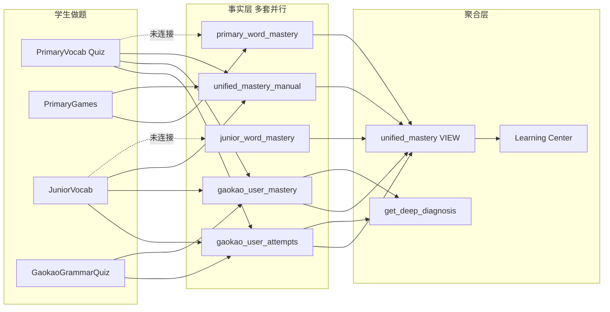

# 只读诊断报告：学习内容架构 · 作答持久化 · 掌握度分析链路

**调查日期：** 2026-05-17  
**调查范围：** 代码库只读审计 + 用户提供的 Supabase RLS 策略导出 CSV  
**约束：** 未修改应用代码与数据库；`docs/db-snapshot.md` **不存在**（仓库仅有 `docs/SOURCE_AUDIT.md`），表结构以 `supabase/migrations/*.sql` 与 `src/integrations/supabase/types.ts` 为准。

---

## A. 内容架构：各年级学习内容存在哪里？

### 结论

学习内容采用 **「Supabase 主库 + 前端 `src/data` 硬编码/JSON 补充」** 的混合架构，按学段（小学 / 初中 / 高中）与年级组织，**没有统一的「学期」字段**；小学部分模块用 `grade`（1–6），初中用 `grade`（7–9），高中多用模块表 + 考试维度而非学期。

| 学段 | 主要存储 | 组织结构 | 确定性 |
|------|----------|----------|--------|
| 小学 Primary | **Supabase：** `primary_vocab`、`primary_units` → `primary_lessons`、`primary_reading_articles`、`primary_grades` 等 | 按 `grade` + `unit` + `lesson`；阅读/词汇在库 | **高** |
| 小学（补充） | **硬编码：** `src/data/primaryPhonics.ts`、`primaryPhonicsG2.ts`、`primarySightWords*.ts`、`pepSightWords.ts`、`primaryStoryBooks*.ts`、`primaryRolePlays*.ts`、`primaryListeningDialogues*.ts` 等 | 按年级门控（如 G2 专用文件）或 catalog 解析 | **高** |
| 初中 Junior | **Supabase：** `junior_vocab`、`junior_themes`、`junior_reading`、`junior_sentences`、`junior_grammar_*`、`junior_listening_exercises` 等 | 页面按 `grade` 过滤（7–9） | **高** |
| 高中 Gaokao | **Supabase：** `gaokao_vocab`、`gaokao_reading_*`、`gaokao_grammar_*`、`gaokao_cloze_*`、`gaokao_listening_*` 等 | 模块制（阅读/语法/词汇/完形/听力/写作），非学期 | **高** |
| 通用主线课程（梅的故事） | **硬编码：** `src/data/course.ts` 的 `LEVELS` / `UNITS` / `LESSONS` | Level → Unit → Lesson，与 DB 小学课表 **并行** | **高** |
| AI 生成课 | **JSON + DB：** `src/data/aiLessonsG2.json`、`lessonSamples.ts`；用户侧 `generated_lessons` 表 | 按生成记录 | **中** |

### 依据（代表性）

- 小学词汇表结构：`supabase/migrations/20260503015231_*.sql`（`primary_vocab`，字段含 `word`, `meaning_cn`, `theme`, `grade`，**无知识点/课标列**）。
- 小学课程树：`supabase/migrations/20260503014116_*.sql`（`primary_units`、`primary_lessons`）。
- 前端硬编码示例：`src/data/course.ts` 第 50 行起 `export const LEVELS`；`src/pages/Primary.tsx` 第 9–12 行从 `@/data/primaryPhonics` 等 import。
- 初中词汇读取：`src/pages/JuniorVocab.tsx` 第 73 行 `from("junior_vocab")`。
- 学习导航学段划分：`src/pages/LearningCenter.tsx` 第 26–29 行 `STAGES`（primary G1–G6 / junior G7–G9 / senior G10–G12）。

---

## B. 作答是否真的被记录？

### 结论

**登录用户：** 多数练习路径 **会** 向 Supabase 写入，但 **写入目标表不一致**，且大量调用使用 `.catch(() => {})`，失败时 **前端无提示（静默失败）**。  
**访客：** 明确 **不** 持久化掌握度（`GuestBanner` + `recordUnifiedAttempt` 在未登录时直接返回）。

**不存在「每题一条、单一作答事实表」**；实际是多套并行事实源。

### 典型数据流（以小学词汇测验 `PrimaryVocab` 为例）

```
用户选题 onPick (PrimaryVocab.tsx ~540)
  → recordCohortAttempt (free_practice) → bumpVocabMastery → gaokao_user_mastery  [高中词汇掌握表]
  → recordAttempt → gaokao_user_attempts.insert                      [高中作答流水]
  → recordUnifiedAttempt → Edge Function record-attempt → unified_mastery_manual
```

**未写入：** `primary_word_mastery`（家长端 `SkillMasteryPanel` 依赖此表）。

### 各路径持久化对照

| 场景 | 是否 insert/upsert | 目标表 / 调用 | 主要字段 | 确定性 |
|------|-------------------|---------------|----------|--------|
| 小学词汇 Quiz (`PrimaryVocab`) | 是 | `gaokao_user_attempts`、`gaokao_user_mastery`、`unified_mastery_manual` | `user_id`, `question_id`/`item_id`, `is_correct`, `user_answer`, `time_spent_seconds`（部分） | **高** |
| 小学词汇 Quiz | **否**（缺口） | `primary_word_mastery` | — | **高** |
| 小学小游戏 (`PrimaryGames`) | 是 | `primary_word_mastery` + `recordUnifiedAttempt` | 分技能计数 `quiz_*`/`listen_*`/…, `mastery_level` | **高** |
| 小学课文 (`PrimaryLesson`) | 完成时 | `primary_lesson_progress`, `learning_events`, `recordUnifiedAttempt` | 课次准确度、事件类型，**非逐题** | **高** |
| 小学 Sight Words Quiz | 是 | `primary_sight_word_mastery`（`bumpSightWordMastery`） | `word_id`, 题型对错计数, SRS | **高** |
| 初中词汇 (`JuniorVocab`) | 是 | `gaokao_user_attempts`, `gaokao_user_mastery`, `unified_mastery_manual` | 同高考路径 | **高** |
| 初中词汇 | **否**（缺口） | `junior_word_mastery` | 前端仅 **SELECT**（SRS 筛选），全库 **无** TS 写入 | **高** |
| 阶段测试 Primary/Junior (`StageTestPlay`) | 是 | `primary_word_mastery` / `junior_word_mastery` + `recordUnifiedAttempt` | `word_id`, `quiz_correct/wrong` | **高** |
| 高考语法题 (`GaokaoGrammarQuiz`) | 是 | `gaokao_user_attempts`, `user_mistakes`, 可选 `classify-mistake-cause` | 逐题 `question_id`, `user_answer`, `is_correct`, `time_spent_seconds` | **高** |
| 访客 | 否 | — | 仅内存/UI | **高** |

### 依据

- 小学 Quiz 三写路径：`src/pages/PrimaryVocab.tsx` 第 558–575 行。
- `recordAttempt` 实现：`src/lib/gaokaoMastery.ts` 第 23–30 行 `gaokao_user_attempts.insert`。
- `recordUnifiedAttempt`：`src/hooks/useRecordAttempt.ts` 第 49–75 行 → `supabase/functions/record-attempt/index.ts` 第 124–143 行 `unified_mastery_manual.upsert`。
- `primary_word_mastery` 写入仅见于：`src/pages/PrimaryGames.tsx` 第 200–202 行；`StageTestPlay.tsx` 第 240–257 行。
- `junior_word_mastery`：全仓库 **无** `insert`/`update`（`grep` 仅 SELECT + `StageTestPlay`）。
- 访客：`src/components/GuestBanner.tsx` 第 7–8 行；`useRecordAttempt.ts` 第 51–54 行。

### 刷新后是否丢失？

- **已登录且写入成功：** 数据在 Supabase，刷新仍在。  
- **未登录或写入被 catch 吞掉：** 等同于丢失。  
- **仅 React 组件 state：** 未完成持久化的中间态会丢（课文内逐步答题若未调 API 则只有完成时落库）。

---

## C. 题目是否带知识点 / 课标标签？

### 结论

**高中（Gaokao）模块：** 有较完整的 **知识点体系**（独立表 + 题目标签表），课标体现在产品文案与 KP 分类字段，而非每题直接挂「课标条目 ID」。  
**小学 / 初中词汇题：** 题库行 **仅有词汇语义字段**（词、释义、主题等），**无** 知识点/课标/技能点字段。  
**阅读/语法题：** 题干表本身通常 **不内嵌 KP**；考点通过 `question_exam_tags` 或 `gaokao_grammar_points.kp_id` 关联。

| 数据 | KP/课标相关字段 | 确定性 |
|------|-----------------|--------|
| `primary_vocab` | 无（`word`, `meaning_cn`, `theme`, `grade`） | **高** |
| `gaokao_reading_questions` | 无内嵌 KP（`stem`, options, `question_type`） | **高** |
| `question_exam_tags` | `knowledge_point_id`, `knowledge_point_label`, `exam_year`, `exam_source` | **高** |
| `gaokao_*_knowledge_points` | 多级分类、`grade_band`, `exam_frequency`, `strategy` 等 | **高** |
| `gaokao_grammar_points` | `kp_id`, `kp_ids` (jsonb) 等（migration `20260502065158`） | **高** |
| 硬编码小学内容 (`src/data/*`) | 无标准 KP 字段 | **高** |

### 依据

- `primary_vocab` 建表：`supabase/migrations/20260503015231_*.sql` 第 2–12 行。
- 阅读题建表：`supabase/migrations/20260501062557_*.sql` 第 54–69 行。
- 标签表：`supabase/migrations/20260513144725_*.sql` 第 3–16 行。
- AI 批量打标签：`supabase/functions/tag-questions-batch/index.ts`（说明标签可后补，非全部题目已有）。

---

## D. 「AI 智能分析掌握情况」功能

### 结论

存在 **多层能力**，成熟度不一：

1. **学习中心 GPS（`/learning-center`）** — **真实聚合**：读 `mastery_overall`、`mastery_with_proportions` 等 **数据库视图**，源自 `unified_mastery`（合并多表）。**非空壳**。确定性：**高**。
2. **`useDiagnostic` / `generate-diagnostic`** — **真实预聚合 + 可选 AI 文案**：RPC `get_diagnostic_summary` 统计 `unified_mastery`；≥50 次练习才调 LLM，否则模板。确定性：**高**。
3. **高考「AI 深度诊断」（`/gaokao/deep-diagnosis`）** — **真实 SQL 聚合 + AI 叙述**：RPC `get_deep_diagnosis` 基于 `gaokao_user_attempts`、`gaokao_user_mastery`、`user_error_analysis`；叙述由 `generate-diagnosis-narrative` 生成。确定性：**高**。
4. **按知识点掌握率（阅读考点强化）** — **有计算逻辑**：`recordKnowledgePointResult` 写 `gaokao_user_mastery`（`item_type='knowledge_point'`），`fetchWeakKnowledgePoints` 聚合。确定性：**高**。
5. **局限：** 深度诊断 **门槛与数据源偏高考**；小学主路径 Quiz **不计入** `get_deep_diagnosis` 的 20 题阈值（见 F）。部分 UI「智能推荐」仅为前端规则（如 `GaokaoReadingKnowledge.tsx` 注释「智能推荐」），非独立分析引擎。确定性：**中–高**。

### 依据

- 学习中心加载：`src/pages/LearningCenter.tsx` 第 85–93 行查询 `mastery_*` 视图。
- `get_diagnostic_summary`：`supabase/migrations/20260510000527_*.sql` 第 148–192 行；`generate-diagnostic/index.ts` 第 7、23、165 行。
- 深度诊断：`src/hooks/useDeepDiagnosis.ts` 第 67–79 行；`get_deep_diagnosis`：`supabase/migrations/20260514153419_*.sql` 第 12–18 行（**仅** `gaokao_user_attempts` 计数）。
- KP 掌握：`src/lib/knowledgePointMastery.ts` 全文。

---

## E. 鉴权与 RLS

### 结论

**策略面：** 用户作答相关核心表均有「本人可 INSERT/UPDATE」策略（CSV 与 migrations 一致），**未见**「完全禁止学生写入」的明显配置错误。  
**实践面：** 静默失败风险主要来自 **(1) 未登录 (2) 前端吞错 (3) 跨表 ID 语义混乱**，而非 RLS 全面封死。

| 表 | 学生写入策略（CSV/迁移） | 静默失败风险 | 确定性 |
|----|-------------------------|--------------|--------|
| `gaokao_user_attempts` | Users insert own attempts | 低（若已登录） | **高** |
| `gaokao_user_mastery` | Users insert/update own | 低 | **高** |
| `primary_word_mastery` | pwm insert/update own | 低 | **高** |
| `junior_word_mastery` | users insert/update own jwm | **中**（策略允许但 **前端几乎不写**） | **高** |
| `unified_mastery_manual` | users insert/update own mastery | 低；依赖 Edge Function 带 JWT | **高** |
| `learning_events` | Users insert own events | 低 | **高** |
| `card_attempts` | Anyone can insert | **高**（匿名可写，与课堂卡片场景相关，非本报告主链路） | **高** |

`get_deep_diagnosis` 为 `SECURITY DEFINER`，传入任意 `p_user_id` 理论上可查他人数据——需靠 **仅前端传 `auth.uid()`** 约束；属安全设计关注点，非本次「写不入」主因。

### 依据

- 用户提供的 RLS CSV：`gaokao_user_attempts` 行 107–108、`primary_word_mastery` 行 296–299、`unified_mastery_manual` 行 338–339。
- `primary_word_mastery` RLS：`supabase/migrations/20260503020842_*.sql` 第 30–34 行。
- 广泛 `.catch(() => {})`：`PrimaryVocab.tsx` 第 558–575 行等。

---

## F. 整体连通性：「做题 → 反推掌握」断在哪？



### 断裂点（按严重性）

1. **小学 / 初中主 Quiz 不写学段掌握表** → 家长面板、SRS 读 `primary_word_mastery` / `junior_word_mastery` **与主 Quiz 脱节**。（**高**）
2. **小学 Quiz 误写 `gaokao_user_mastery`**（`recordCohortAttempt`/`bumpVocabMastery`）→ 用 **小学词 UUID** 污染高考掌握度维度。（**高**）
3. **`get_deep_diagnosis` 只统计 `gaokao_user_attempts`** → 小学若只走 `recordUnifiedAttempt`，深度诊断 **长期「数据不足」**。（**高**）
4. **题目标签覆盖不全** → 无 `question_exam_tags` 的题无法做细粒度 KP 分析。（**中**）
5. **`user_error_analysis` 依赖 Edge `classify-mistake-cause`** → 仅部分错题路径触发，error_breakdown 可能长期为空。（**中**）
6. **错误处理静默** → RLS/网络错误不可见。（**中**）

---

## 总判定

### 以目前的代码和数据结构，「按学生掌握情况做分析」能不能跑通？

**判定：部分能（Partial）**

| 场景 | 能否跑通 | 说明 |
|------|----------|------|
| 高中刷题 + 深度诊断 + 阅读 KP 强化 | **基本能** | 作答、掌握度、KP 表、RPC 链路齐全 |
| 学习中心总览（全学段） | **部分能** | 依赖 `unified_mastery` 视图；小学 Quiz 不写 `primary_word_mastery` 时词汇维度偏空 |
| 小学 / 初中日常词汇 Quiz → 家长「掌握情况」 | **不能可靠跑通** | 主路径不写 `*_word_mastery`，却读该表展示 |
| 跨学段统一「课标知识点掌握率」 | **不能** | 小学/初中题库无 KP 字段；标签表偏 Gaokao |

### 修补即可 vs 需重做？

- **修补即可（中等工程量）：** 统一各页面写入正确的学段表；去掉或分流 `PrimaryVocab`/`JuniorVocab` 对 `gaokao_user_mastery` 的调用；扩展 `get_deep_diagnosis` / `get_diagnostic_summary` 数据源；暴露写入错误。
- **需产品级重做（若目标是全学段课标级分析）：** 统一「题目 → 知识点 → 掌握度」本体模型，为题库补 KP/课标映射，单一作答事实表或事件流，避免 `unified_mastery` 视图层硬拼。

---

## 建议修复优先级（本次不执行）

1. **P0 — 修正小学/初中词汇作答落库目标**  
   `PrimaryVocab` / `JuniorVocab` 在答题时 upsert `primary_word_mastery` / `junior_word_mastery`（可复用 `PrimaryGames.recordWordResult` 逻辑），并 **停止** 对 `bumpVocabMastery`（`gaokao_user_mastery`）的误用。

2. **P0 — 取消静默失败**  
   对 `recordUnifiedAttempt`、`recordAttempt`、学段 mastery upsert 记录 `error`（至少 `console.error` + 可选 toast），便于区分 RLS 与网络问题。

3. **P1 — 对齐分析数据源**  
   `get_deep_diagnosis` 的 `current_attempts` 纳入 `unified_mastery_manual` 或分学段 attempt 表；`get_diagnostic_summary` 与学习中心已用视图，保持单一语义。

4. **P1 — 深度诊断与小学/初中产品打通**  
   家长端 `SkillMasteryPanel` 与学习中心共用同一事实源；文案避免「已接入智能复习」而实际未写表（`PrimaryVocab.tsx` 第 680 行）。

5. **P2 — 题目标签覆盖率**  
   跑通 `tag-questions-batch`，补全 `question_exam_tags`；语法题确保 `kp_id` 关联。

6. **P2 — 课标级分析（可选战略项）**  
   为 `primary_vocab` / `junior_vocab` 增加 `curriculum_tag` 或 KP 外键；否则接受「小学只有词级掌握，无课标点级分析」。

7. **P3 — 安全**  
   审查 `get_deep_diagnosis(p_user_id)` 是否应强制 `p_user_id = auth.uid()`。

---

## 附录

- **缺失文档：** `docs/db-snapshot.md` 不存在；本报告以 migrations + `types.ts` 代替。  
- **RLS 来源：** `Supabase Snippet Public Table Column Metadata (4).csv`（内容为 `tablename,policyname,cmd`，非列元数据）。  
- **相关现有文档：** `docs/SOURCE_AUDIT.md`（词汇 `AttemptSource` 路由说明，偏 Gaokao cohort）。
